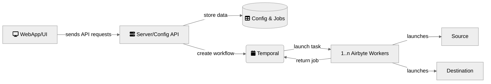

# Airbyte Architecture



1. Web App/UI [`airbyte-webapp`, `airbyte-proxy`]
    - An easy-to-use graphical interface for interacting with the Airbyte API.
2. Server/Config API [`airbyte-server`, `airbyte-server-api`]
    - Handles connection between UI and API. Airbyte's main control plane. All operations in Airbyte such as creating sources, destinations, connections, managing configurations, etc.. are configured and invoked from the API.
3. Database Config & Jobs [`airbyte-db`]
    - Stores all the connections information \(credentials, frequency...\).
* Temporal Service [`airbyte-temporal`]
    - Manages the task queue and workflows.
4. Worker [`airbyte-worker`]
    - The worker connects to a source connector, pulls the data and writes it to a destination.
5. Cron [`airbyte-cron`]
    - Clean the server and sync logs (when using local logs)
6. Bootloader [`airbyte-bootloader`]
    - Upgrade and Migrate the Database tables and confirm the enviroment is ready to work.
7. minio [`airbyte-minio`]
    - for logs storage
8. pod-sweeper [`airbyte-pod-sweeper`]
    - clears the successful/error pods once they are done

# Local check

requirements

```bash
❯ docker --version
Docker version 25.0.3, build 4debf41

❯ kubectl version
Client Version: v1.29.3
Kustomize Version: v5.0.4-0.20230601165947-6ce0bf390ce3
Server Version: v1.27.4+k3s1
WARNING: version difference between client (1.29) and server (1.27) exceeds the supported minor version skew of +/-1

❯ k3d --version
k3d version v5.6.0
k3s version v1.27.4-k3s1 (default)

❯ k9s version
 ____  __.________
|    |/ _/   __   \______
|      < \____    /  ___/
|    |  \   /    /\___ \
|____|__ \ /____//____  >
        \/            \/

Version:    0.32.4
Commit:     d3027c8f2916b23606f647f47b434b08fc34bdf8
Date:       n/a
```

setup

```bash
❯ make up
❯ kubectl apply -f resources/
❯ kubectl run busybox --image=busybox -n airbyte --restart=Never --rm -it --command -- wget airbyte-airbyte-webapp-svc:80
❯ open http://localhost:8081/
```


help
```bash
❯ helm search repo airbyte
NAME                                    CHART VERSION   APP VERSION     DESCRIPTION
airbyte/airbyte                         0.56.16         0.53.1          Helm chart to deploy airbyte
airbyte/airbyte-api-server              0.56.16         0.53.1          Helm chart to deploy airbyte-api-server
airbyte/airbyte-bootloader              0.56.16         0.53.1          Helm chart to deploy airbyte-bootloader
airbyte/airbyte-cron                    0.40.37         0.40.17         Helm chart to deploy airbyte-cron
airbyte/airbyte-workload-api-server     0.49.18         0.50.33         Helm chart to deploy airbyte-api-server
airbyte/connector-builder-server        0.56.16         0.53.1          Helm chart to deploy airbyte-connector-builder-...
airbyte/cron                            0.56.16         0.53.1          Helm chart to deploy airbyte-cron
airbyte/keycloak                        0.56.16         0.53.1          Helm chart to deploy airbyte-keycloak
airbyte/keycloak-setup                  0.56.16         0.53.1          Helm chart to deploy airbyte-keycloak-setup
airbyte/metrics                         0.56.16         0.53.1          Helm chart to deploy airbyte-metric
airbyte/pod-sweeper                     0.56.16         0.53.1          Helm chart to deploy airbyte-pod-sweeper
airbyte/server                          0.56.16         0.53.1          Helm chart to deploy airbyte-server
airbyte/temporal                        0.56.16         0.53.1          Helm chart to deploy airbyte-temporal
airbyte/webapp                          0.56.16         0.53.1          Helm chart to deploy airbyte-webapp
airbyte/worker                          0.56.16         0.53.1          Helm chart to deploy airbyte-worker
airbyte/workload-api                    0.50.3          0.50.35         Helm chart to deploy the workload-api service
airbyte/workload-api-server             0.56.16         0.53.1          Helm chart to deploy the workload-api service
airbyte/workload-launcher               0.56.16         0.53.1          Helm chart to deploy airbyte-workload-launcher
```

# Caveat

1. https://ts223.hatenablog.com/entry/2023/11/04/215806#f-59885df8

# Reference
1. https://docs.airbyte.com/understanding-airbyte/high-level-view
2. https://discuss.airbyte.io/t/what-do-these-pods-do-when-using-k8s/1944